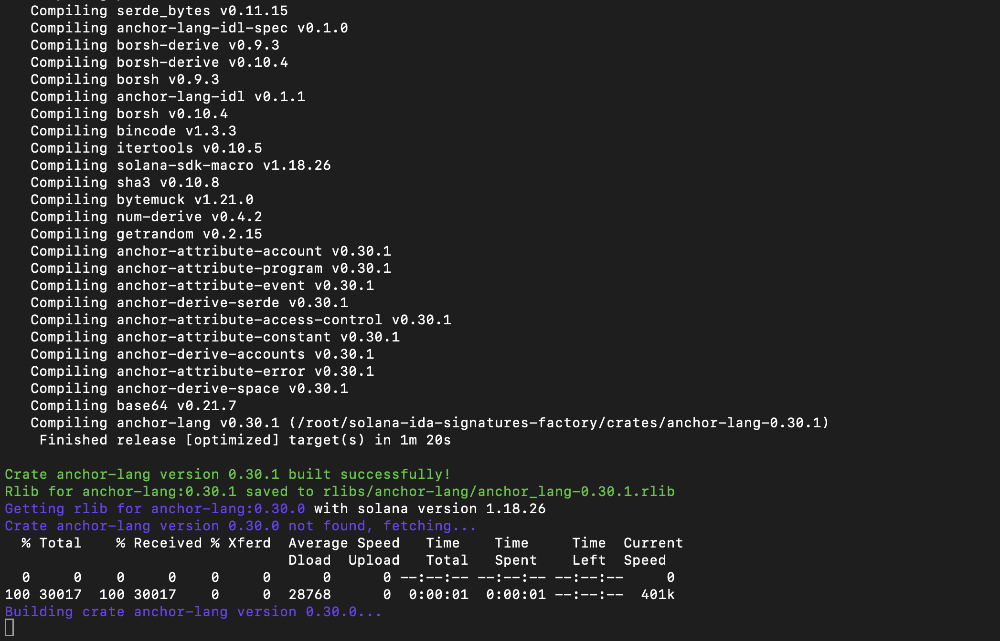

# Solana IDA Signatures Factory

This repository contains all scripts needed to generate IDA Pro FLIRT signatures for Solana libraries. Use the plugin [solana-ebpf-ida-processor](https://github.com/PassKeyRa/solana-ebpf-ida-processor) to load Solana program binaries and then apply the generated signatures to detect library functions.

## Usage

### Install requirements

```bash
pip install -r requirements.txt
```

### Fetch versions list for a crate

For the `anchor-lang` crate:

```bash
python3 versions/fetch-crate-versions.py anchor-lang > versions/anchor-lang.txt
```

### Build all crate versions using a specific solana version and extract rlibs

For the `anchor-lang` crate and solana version `1.18.26`:

```bash
python3 get-rlibs-from-crate.py --solana-version 1.18.26 --crate anchor-lang --versions-file versions/anchor-lang.txt
```

This command automatically downloads the specified solana version into the `solana/` directory, fetches and builds all versions of the `anchor-lang` crate listed in the `versions/anchor-lang.txt` file. After that, for each version the resulted .rlib file is extracted and saved in the `rlibs/<crate-name>/` directory.

**If the `solana-program` crate is specified, the equal solana version will be used for each crate version**



### Generate .pat files via FLAIR preprocessor

```
usage: flair-preprocessor.py [-h] [-if INPUT_FOLDER] [-of OUTPUT_FOLDER] [-i INPUT_FILE] [-o OUTPUT_FILE]

Solana eBPF libraries PAT files generator

options:
  -h, --help            show this help message and exit
  -if INPUT_FOLDER, --input-folder INPUT_FOLDER
                        Folder with .rlib or .o libraries
  -of OUTPUT_FOLDER, --output-folder OUTPUT_FOLDER
                        Resulted PAT files folder (separate file for each library)
  -i INPUT_FILE, --input-file INPUT_FILE
                        Single library file
  -o OUTPUT_FILE, --output-file OUTPUT_FILE
                        Single resulted PAT file
```

Example:

```bash
python3 flair-preprocessor.py -if rlibs/anchor-lang/ -of sigs/anchor-lang/
```

